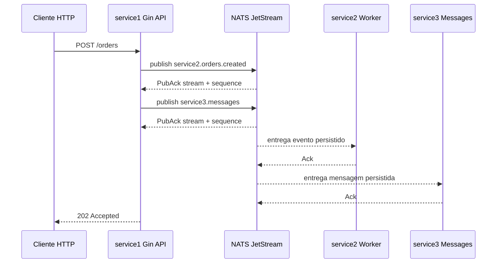

# eventbridge-go

`eventbridge-go` demonstra um fluxo assíncrono simples com três serviços Go usando Gin, NATS e JetStream local.

## Metadata

- Repository: `https://github.com/vinnicostaa/eventbridge-go`
- Author: `Vinícius Oliveira <vinnicius.olliveira.costaa@outlook.com.br>`
- Developer signature: commits in this repository should use DCO-style `Signed-off-by` trailers.
- Go module paths:
  - `github.com/vinnicostaa/eventbridge-go/service1`
  - `github.com/vinnicostaa/eventbridge-go/service2`
  - `github.com/vinnicostaa/eventbridge-go/service3`

## Serviços

- `service1`: API HTTP com Gin. Recebe `POST /orders` e publica duas mensagens persistidas no JetStream:
  - um **evento** para o `service2` no subject `service2.orders.created`;
  - uma **mensagem** para o `service3` no subject `service3.messages`.
- `service2`: worker JetStream. Consome o evento `service2.orders.created` usando durable consumer e ACK manual.
- `service3`: consumidor JetStream. Consome mensagens em `service3.messages` usando durable consumer e ACK manual.

A stream usada é criada automaticamente pelos serviços com o nome `SERVICE_EVENTS`.
Os serviços usam o pacote recomendado `github.com/nats-io/nats.go/jetstream`, com stream e consumers criados explicitamente via `context.Context`.

## Fluxo



## Rodando localmente

### 1. Subir o NATS com JetStream

Como você já tem o binário instalado, rode em um terminal:

```bash
nats-server -js
```

O `-js` é obrigatório para habilitar o JetStream. Por padrão, o NATS sobe em `nats://localhost:4222`, que é o padrão usado pelos serviços.

Se quiser habilitar também o monitoramento HTTP do NATS:

```bash
nats-server -js -m 8222
```

A página de monitoramento ficará em `http://localhost:8222`.

### 2. Subir o service2

Em outro terminal:

```bash
go -C service2 run .
```

Esse serviço fica aguardando eventos persistidos no subject `service2.orders.created` com:

- durable consumer: `service2-order-worker`
- deliver subject: `deliver.service2.orders.created`
- queue group: `order-workers`
- ACK manual

### 3. Subir o service3

Em outro terminal:

```bash
go -C service3 run .
```

Esse serviço fica aguardando mensagens persistidas no subject `service3.messages` com:

- durable consumer: `service3-message-consumer`
- deliver subject: `deliver.service3.messages`
- ACK manual

### 4. Subir o service1

Em outro terminal:

```bash
go -C service1 run .
```

A API ficará disponível em `http://localhost:3000`.

> Observação: como a stream é criada automaticamente por qualquer serviço, você só precisa garantir que o `nats-server -js` esteja rodando antes dos serviços Go.

## Testando

Health check:

```bash
curl http://localhost:3000/ping
```

Criar pedido e publicar o evento + mensagem via JetStream:

```bash
curl -X POST http://localhost:3000/orders \
  -H "Content-Type: application/json" \
  -d '{"customer":"Vinni","product":"Go + Gin + NATS","quantity":1}'
```

Resposta esperada:

```json
{
  "status": "order accepted",
  "published": {
    "event_to_service2": {
      "subject": "service2.orders.created",
      "stream": "SERVICE_EVENTS",
      "sequence": 1
    },
    "message_to_service3": {
      "subject": "service3.messages",
      "stream": "SERVICE_EVENTS",
      "sequence": 2
    }
  },
  "order_event": {
    "id": "ord_...",
    "customer": "Vinni",
    "product": "Go + Gin + NATS",
    "quantity": 1,
    "created_at": "..."
  },
  "service3_message": {
    "id": "msg_...",
    "order_id": "ord_...",
    "text": "Novo pedido ord_... criado para Vinni",
    "sent_at": "..."
  }
}
```

Nos logs:

- `service2` deve mostrar o evento `order_created` recebido e confirmado com `Ack()`;
- `service3` deve mostrar a mensagem recebida e confirmada com `Ack()`.

## Conferindo o JetStream

Se você tiver o NATS CLI instalado além do `nats-server`, pode conferir a stream:

```bash
nats stream info SERVICE_EVENTS
```

E os consumers:

```bash
nats consumer info SERVICE_EVENTS service2-order-worker
nats consumer info SERVICE_EVENTS service3-message-consumer
```

## Variáveis de ambiente

Os serviços usam estes padrões:

- `NATS_URL=nats://localhost:4222`
- `HTTP_ADDR=:3000` somente no `service1`

Exemplo mudando a URL do NATS:

```bash
NATS_URL=nats://localhost:4223 go -C service1 run .
```

## Stream e subjects

Stream criada automaticamente:

- `SERVICE_EVENTS`

Subjects dentro da stream:

- `service2.orders.created`: evento publicado pelo `service1` para o `service2`.
- `service3.messages`: mensagem publicada pelo `service1` para o `service3`.

Configuração da stream no exemplo:

- storage: `FileStorage`
- retention: `LimitsPolicy`
- max age: `24h`

O `service2` usa queue group (`order-workers`) para demonstrar balanceamento: se você subir mais réplicas do `service2`, apenas uma delas processa cada evento dentro desse grupo.
